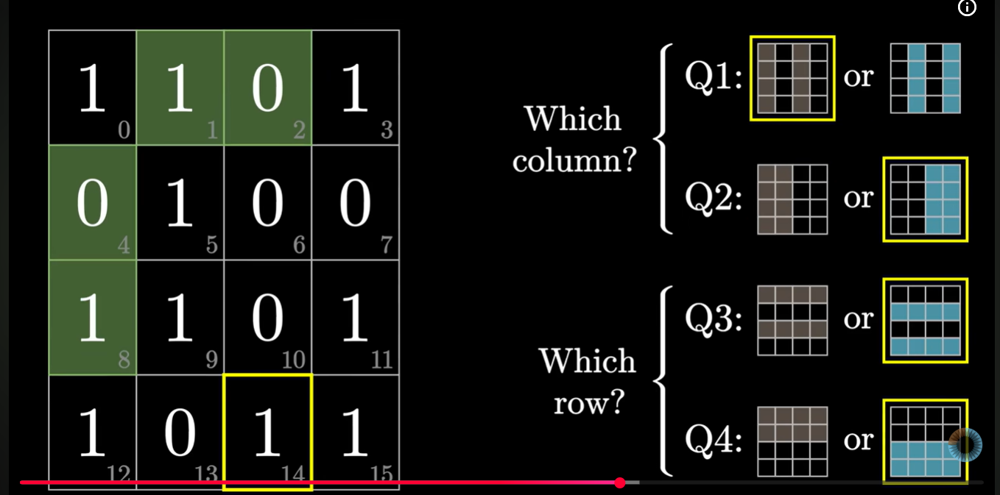
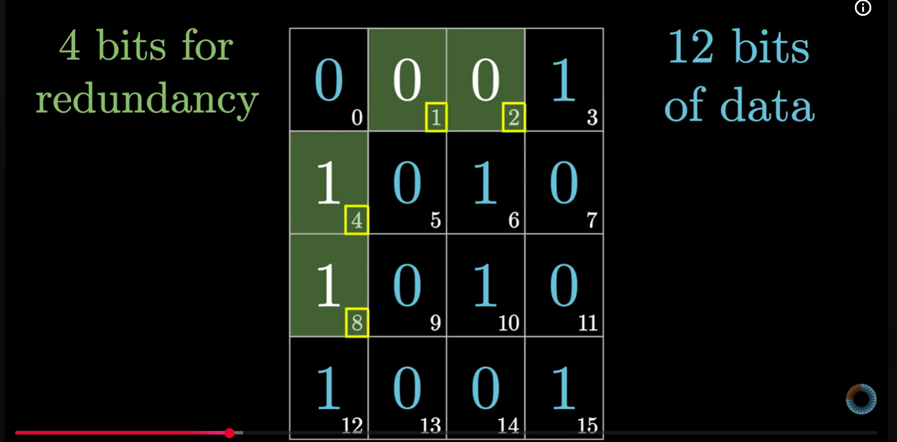
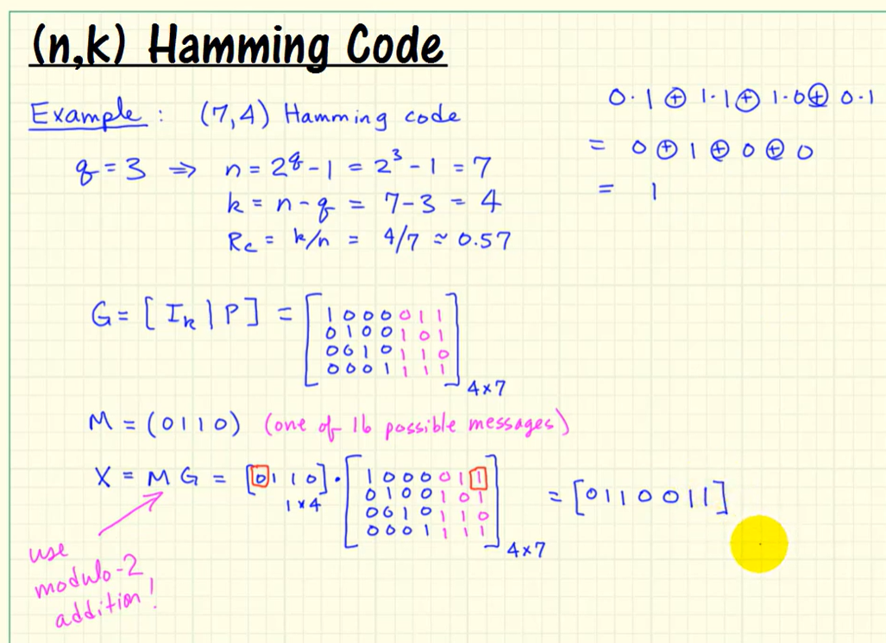

# Hamming Codes

## Nomenclature

SECDED(n, k), e.g. SECDED(39, 32) means

n = 39 is the size of the overall block (information and check bits)

k = 32 is the number of information bits

(n - k) = m check bits

## Hamming Distance

Explanation on [Hamming Distance](https://www.youtube.com/watch?v=kO6UlCY6idg) and invalid codewords

As explained in this[article](https://www.quora.com/What-is-the-hamming-distance-and-how-does-it-help-to-detect-errors-in-data-communication), if the hamming distance between any two distinct & valid codewords for a given code is D:

1. Up to D-1 errors can be detected, since any pattern of up to **D−1 bit flips** cannot transform one valid codeword into a different valid one, so the receiver can tell **something changed**. For example: a code with minimum distance 3 detects up to 2 bit errors.

2. The same minimum distance D lets the code correct up to **t = floor((D−1)/2)** bit errors by nearest-neighbor decoding: the received word is assigned to the closest codeword. If ≤ t errors occurred, the original codeword **remains the unique nearest codeword**, so that the original message can be recovered by choosing the nearest valid codeword. For example: distance-3 codes correct 1-bit errors.

## Concept

As explained in 3B1B video on [Hamming Codes](https://youtu.be/b3NxrZOu_CE?si=L7SbZG82WABLGXN_), each parity bit adds check on a subset of the block (data and parity bits), such that all the checks combined together pin point to the exact bit that has an error (single bit)

This property is obtained when the bits in positions **p = 2^r** are used as parity bits, such that they check the parity for the bits in positions k such that **k & p != 0**. This is illustrated well in the table shown in [this article](https://www.geeksforgeeks.org/computer-networks/hamming-code-in-computer-network/)

Another overall parity bit is added to extend the hamming code, so that parity for the entire block is also calculated.

The combined 16-bit code has the data and parity bits placed as (**LSB to MSB**)

**Pf-P0-P1-D0-P2-D1-D2-D3-P3-D4-D5-D6-D7-D8-D9-D10**

Here, Pf is overall parity bit, and P0, P1, P2 and P3 are parity bits (2^r)

The following equations can be used to calculate the above 5 parity bits, assuming that the data bits are grouped together ([message vector](#generator-and-checker-matrices) as described below), but in reverse order (**MSB to LSB**)

P0 with Mask(P0, D0, D1, D3, D4, D6, D8, D10) = ^(data[10:0] & 'b101_0101_1011) = **^(data[10:0] & 0x55B)**

P1 with Mask(P1, D0, D2, D3, D5, D6, D9, D10) = ^(data[10:0] & 'b110_0110_1101) = **^(data[10:0] & 0x66D)**

P2 with Mask(P2, D1, D2, D3, D7, D8, D9, D10) = ^(data[10:0] & 'b111_1000_1110) = **^(data[10:0] & 0x78E)**

P3 with Mask(P3, D4, D5, D6, D7, D8, D9, D10) = ^(data[10:0] & 'b111_1111_0000) = **^(data[10:0] & 0x7F0)**

> Note that the lower 2 nibbles of the HEX mask values match the masks used for [(22, 16) encoder](https://github.com/lowRISC/opentitan/blob/master/hw/ip/prim/rtl/prim_secded_hamming_22_16_enc.sv) generated using [script](https://github.com/lowRISC/opentitan/blob/master/util/design/secded_gen.py). The idea is that if we use similar logic to calculate the parity bit masks for (22, 16) code, we'll arrive at exact masks as in this generated verilog code.

and Pf, the overall parity doesn't mask-out any bits:

Pf = **^(P[3:0] | data[10:0])** where | is concatenation operation

The ^() is the reduction XOR operator in this context (verilog syntax), which is equivalent to modulo-2 addition

### All 0's and 1's code words

For storage ECC, all 0's and all 1's have a [special significance](https://opentitan.org/book/hw/top_earlgrey/ip_autogen/flash_ctrl/doc/theory_of_operation.html#reliability-ecc:~:text=The%20ECC%20for%20flash%20is%20chosen%20such%20that%20a%20fully%20erased%20flash%20word%20has%20valid%20ECC.%20Likewise%20a%20flash%20word%20that%20is%20completely%200%20is%20also%20valid%20ECC.)

1. In Flash, when a sector is erased, all the bits are set, leading to all 1's stored. This means that when M = 'b1 (all 1's message), the valid parity bits nust also be all 1's

2. Since Flash doesn't support a single word erase, a common method used is to clear all the bits (including parity bits), so that the stored data is cleared. But such a resulting code word must also be valid, i.e., when all data bits are 0, the parity bits must also all be 0.

It is simple to see that from above equations to calculate parity bits, ensuring all 0's conditions is automatically obtained. 

Further, since for each parity bit P0 to P3, an odd number of data bits are combined, if all data bits are 1, the (even parity) calculation also ensures that all of the parity bits are also 1. Finally, in this specific case, since block size is even, there are odd number of bits, other than Pf, and which implies that Pf will also be 1 (if all other bits are 1)

To generalize that all 1's is a valid codeword:

1. The parity check matrix H must have even number of 1's in every row, so that matrix multiplication with received vector R (all 1's) is zero for every row of H

## Number of Parity Bits Needed

Based on above explanation, the number of parity bits m needed are

2^m >= k + m + 1

This is because

1. m parity bits can be used to create 2^m subsets of the block

2. The block length is (k + m + 1) for extended hamming code (k data bits, m parity bits for subsets and 1 overall parity bit)

> In this context, let us define n = k + m, even though the overall parity bit is added so that the overall block size is n + 1

3. To identify exactly which bit got flipped, the number of subsets must be at least equal to the block size

Here's the table for some common data widths:

| Data Width (k) | Parity Bits (m) | Block Width (k + m + 1) | No. of subsets (2^m) | All 0's | All 1's | Notes |
| --- | --- | --- | --- | --- | --- | --- |
| 4 | 3 | 8 | 8 | 0 TODO | 1 TODO | - |
| 8 | 4 | 13 | 16 | 0 TODO | 1 TODO | - |
| 11 | 4 | 16 | 16 | [Yes](#all-0s-and-1s-code-words) | [Yes](#all-0s-and-1s-code-words) | Example from 3B1B |
| 16 | 5 | 22 | 32 | 0 TODO | 1 TODO | - |
| 32 | 6 | 39 | 64 | 0 TODO | 1 TODO | - |
| 64 | 7 | 72 | 128 | 0 TODO | 1 TODO | - |
| 68 | 7 | 76 | 128 | 0 TODO | 1 TODO | A non-standard combination, but it maybe used for secure memories, with 4 additional bits used for CRC to check integrity of data scrambling (as used in [OpenTitan](https://opentitan.org/book/hw/top_earlgrey/ip_autogen/flash_ctrl/doc/theory_of_operation.html#overall-icv-and-ecc-application)) |

## Generator and Checker Matrices

What are [Generator Matrices](https://www.youtube.com/watch?v=siMKiIFSmV0) in the context of ECC?

https://www.emergentmind.com/topics/ecc-secded

The generator matrix G can be used to determine the parity bits for a given data codeword (vector)

Message Vector M = (m1, m2, m3, ..., mk) of size 1 x k

Check bits (or parity) Vector C = (c1, c2, c3, ..., cm) of size 1 x m (in this video, they use g in place of m)

Overall Code Vector is concatenation of M and C, X = (M | C) of size 1 x n. Note that here, we're not considering the overall parity bit

X can be derived using, X = MG (matrix multiplication), where G is the generator matrix (of size k x n) defined as:

G = [Ik | P], where Ik is the k x k identity matrix, and P is the parity matrix of size k x m

The identity matrix simply copies the data bits to the final codeword, while the parity matrix calculates the check bits

### Parity Matrix

> This section is currently WIP

Based on 3B1B and GeeksforGeeks explanation, columns of P can be determined as follows:

1. Each column of P gets multiplied by the message vector bits, and constituents are added. This is same as using the column of P as **mask** to select the participating bits from the message vector to calculate the parity

2. Accordingly, for each parity bit p = 2^r where r in [0, m-1], generate the column r of matrix P such that

Pr (r-th column of P) = Vector with k values such that **j & 2^r != 0** for j in [0, k - 1]

The table below shows the Parity matrix for Hamming Code (11,4) as explained in 3B1B video

| Data Bit | Code Bit | 2^0 | 2^1 | 2^2 | 2^3 |
| --- | --- | --- | --- | --- | --- |
| 0 | 3 | 
| 1 | 5
| 2 | 6
| 3 | 7
| 4 | 9
| 5 | 10
| 6 | 11
| 7 | 12
| 8 | 13
| 9 | 14
| 10 | 15

### Parity-Check Matrix

> This section is currently WIP

H = [P' | Im] is of size (m x n)

where P' (size m x k) is transpose of P, and Im is identity matrix of size (m x m)

The decoding process constitutes

S = HR'

where

 * R' (size n x 1) is the transpose of received message vector R, and

 * S is the syndrome vector, which tells which parity bit detected the error

Each row of H is effectively the concatenation of **column of P** and **identify matrix**, so each element of S is vector multiplication, which is effectively selecting a subset of received vector R according to parity bit definition (essentially the same operation as used to generate parity bits)

1. If S = 0, no error is present, i.e., R = M

2. If S matches a column i of H, the ith bit in R has the error and can be corrected (by flipping)

OPEN: Understand why above and below

3. If S = hi ^ hj for 2 columns i and j in H, then a double bit error is detected